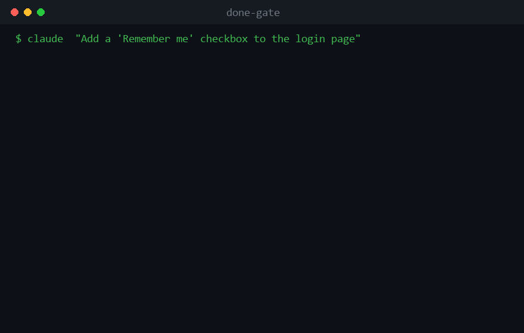

# done-gate



<sub>Scripted recreation of the flow — not a live capture.</sub>


An **acceptance-gated wrap-up skill** for Claude Code.

> The problem: Claude Code writes code and self-tests it — but "tests pass" is not
> "the thing the user wanted is done". done-gate hands the final call back to you:
> **nothing is done until you personally check it off.**

English ｜ [繁體中文](README.zh.md)

## Table of Contents

- [Core idea](#core-idea)
- [Why you need it](#why-you-need-it)
- [Example session](#example-session)
- [Install](#install)
- [Usage](#usage)
- [Features](#features)

## Core idea

Before wrapping up any round of work, Claude must:

1. Explain, in **plain non-technical language**, what was built, where it is, and how to use it;
2. List the features as a **checklist** for you to verify — **only checked items pass**;
3. For unchecked items, **ask why first** (bug / wants improvement / custom), then fix accordingly,
   looping until you check everything off.

Claude must not self-declare completion, check items on your behalf, or wave it off as "should be fine".

## Why you need it

| | Without done-gate | With done-gate |
|---|---|---|
| Definition of done | Claude self-judges "tested, should be fine" | **You check it off** |
| When it wraps up | Claude declares done and stops | Won't wrap up until you check everything |
| Result summary | File names, functions, jargon | Plain: **what / where / how to use** |
| When something's off | You re-describe the requirement yourself | It **asks why** and fixes accordingly |
| Delivery record | Scattered in the chat | Auto-written to `ACCEPTANCE.md`, traceable |

## Example session

```
You: Add an "Export report" button to the settings page

Claude: (after coding & self-testing, done-gate triggers before wrap-up)

  What was built (plain language)
  Export report
  - What it does: save the data on screen to a file in one click, to email or keep.
  - Where it is: top-right button row on the settings page, the one labeled "Export".
  - How to use: 1) pick a month → 2) click "Export" top-right → 3) choose where to save.

  [Checklist] Check the items you've confirmed are done:
  ☐ Export report

You: (leave it unchecked — want a change)

Claude: "Export report" is unchecked. Why?
  ○ Bug  ○ Wants improvement  ○ Custom

You: Wants improvement → add a "choose columns" option

Claude: (fixes, re-verifies only this item) … wraps up only after you check ✅,
        then writes ACCEPTANCE.md.
```

## Install

This repo is a **Claude Code plugin**. Two ways to use it:

**A — As a plugin (recommended):** add this repo as a plugin source in Claude Code.
The skill and the `/done-gate-status` · `/done-gate-log` commands become available everywhere.

**B — As a project skill:** copy `skills/done-gate/` into a project's `.claude/skills/`
and add the standing rule from `CLAUDE.md`. It then auto-loads when you open that project.

```
.
├── .claude-plugin/plugin.json   # plugin manifest
├── skills/done-gate/SKILL.md  # the skill (core logic)
├── commands/                    # /done-gate-status, /done-gate-log
├── references/                  # deep-dive docs, loaded on demand
├── examples/                    # sample ACCEPTANCE.md
└── CLAUDE.md                    # standing rule: run done-gate before every wrap-up
```

## Usage

Triggers automatically at wrap-up, or invoke manually:

```
/done-gate                       # run the acceptance flow
/done-gate log:off as:elder lang:both
/done-gate-status                # snapshot of this round's pass/pending
/done-gate-log                   # summarize ACCEPTANCE.md history
/done-gate-config as:client      # view/set per-project defaults (.done-gate.json)
/done-gate-handoff               # generate a plain-language handoff doc
/done-gate-explain <feature>     # re-explain one feature in plain language
```

| Param | Values | Default | Effect |
|------|----|------|------|
| `log:` | `on` / `off` | `on` | Write the acceptance into `ACCEPTANCE.md` |
| `as:`  | `user` / `elder` / `pm` / `client` | `user` | Audience & tone of the plain-language summary |
| `lang:`| `en` / `zh` / `both` | `en` | Output language |

## Features

- 🛡️ **No self-pass**: pass/fail is decided only by your checkmark.
- 🗣️ **Plain-language delivery**: only "what / where / how", no code or jargon.
- ✅ **Checklist verify + fix loop**: unchecked items become new requirements.
- ❓ **Failure diagnosis**: unchecked items prompt for a reason (bug / improve / custom) first.
- 📋 **Delivery log `ACCEPTANCE.md`**: auto-recorded per round, traceable (toggleable).
- 👥 **Audience switch**: explain to an elder / PM / client, tone adapts.
- 🌐 **Bilingual output (ZH / EN)**.
- 📸 **Screenshot annotation** (web, via playwright; skipped if unavailable).
